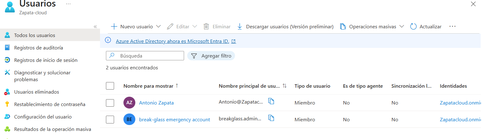
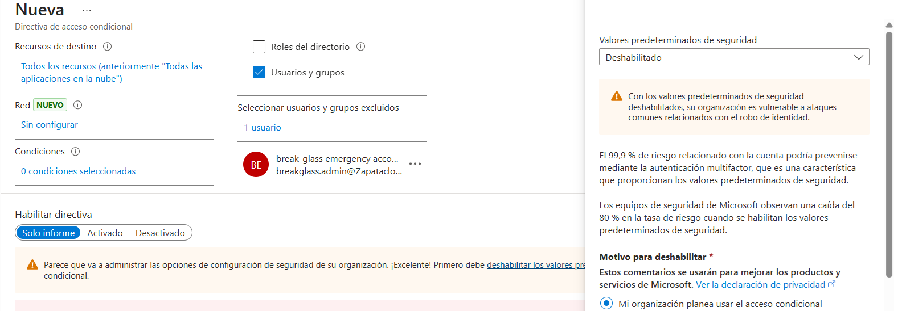
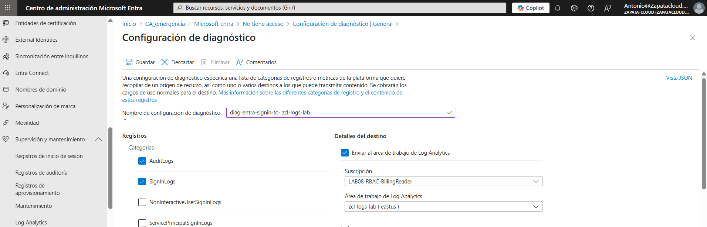
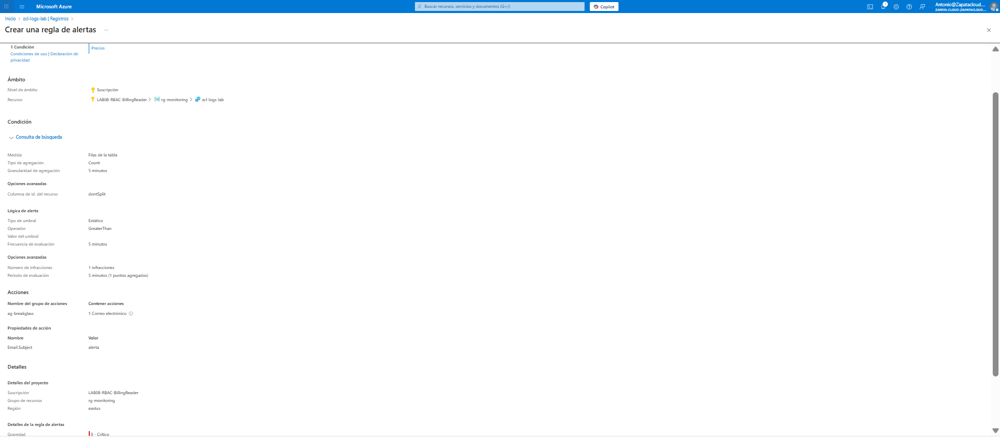

# Lab 01 — Resiliencia de Identidad: Cuenta de Emergencia (Break-Glass)

## Por qué hice este laboratorio
Antes de tocar políticas sensibles como **Conditional Access** y **MFA**, el mayor riesgo es quedarme fuera del tenant por un error de configuración (administrative lock-out).  
Este laboratorio es mi “seguro de vida” técnico: una cuenta de emergencia preparada para **recuperar el acceso** si el MFA falla, si bloqueo a los administradores o si configuro mal una directiva.

## Objetivo
Garantizar acceso administrativo al tenant en escenarios críticos:
- Fallo de MFA
- Bloqueo accidental de administradores por CA
- Configuraciones de seguridad mal aplicadas (CA / Identity Protection)

---

## Qué he implementado

### 1) Cuenta Break-Glass dedicada
He creado una cuenta **exclusiva para emergencias** (tipo *Member*):

- UPN: `breakglass.admin@zapatacloud.onmicrosoft.com`
- Uso: **solo recuperación**, nunca para trabajo diario

**Evidencia**  

---

### 2) Rol Administrador Global
A la cuenta break-glass le he asignado el rol **Global Administrator** para poder recuperar el tenant ante cualquier bloqueo.

**Evidencia**  

---

### 3) Exclusión en Conditional Access (MFA)
Para evitar un lock-out total, la cuenta break-glass está **excluida** de las directivas de Acceso Condicional que exigen MFA.

**Evidencia**  

---

### 4) Monitorización: Log Analytics + Alerta por email
Como la cuenta no tiene MFA, la protejo con controles compensatorios.  
He configurado monitorización para que **cualquier uso de la cuenta** genere señal y notificación:

- **Entra ID → Configuración de diagnóstico**: envío de `SignInLogs` y `AuditLogs` a un **Log Analytics Workspace**.
- **Azure Monitor (Alertas)**: regla que dispara si aparece un evento de inicio de sesión de la cuenta break-glass y envía email mediante un **Action Group**.

**Evidencia (diagnóstico Entra → Log Analytics)**  

**Evidencia (alerta por uso de break-glass)**  

---

## Checklist de control (validado)
- [x] Existe una cuenta break-glass tipo *Member*
- [x] Tiene rol **Global Administrator**
- [x] Está excluida de las políticas de CA/MFA
- [x] No tiene licencias asignadas
- [x] Se monitoriza su uso con **Log Analytics + alerta por email**
- [x] No se usa para el día a día

---

## Buenas prácticas aplicadas (controles compensatorios)
- Contraseña larga/única guardada fuera del tenant (offline)
- Cero uso diario (solo emergencias)
- Sin licencias asignadas
- Alerta inmediata por email ante cualquier intento de inicio de sesión

---

## Qué explicaría en una entrevista
“Antes de aplicar Conditional Access o MFA, implemento una cuenta break-glass con rol Global Admin para evitar un lock-out total. No se trata solo de crear un usuario sin MFA: la excluyo de CA, la protejo con una contraseña offline y monitorizo su uso. Si esa cuenta se usa, lo considero una emergencia real o un incidente y se investiga inmediatamente.”

---

